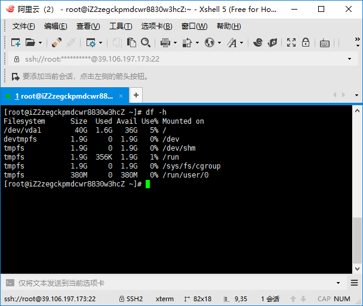

# 服务器的购买，centos 7 服务器的管理

服务器准备用centos 7，并且在阿里云购买，下面一一介绍
## 服务器的购买
服务器的购买相对比较简单，直接选配置，付款就好，具体如下：  
首页左上角 -> 产品 -> 精选 -> 云服务器 ECS  
进入页面后点立即购买，按提示操作就好。
需要注意的是，在“系统配置”阶段，登录凭证选自定义密码，并设置好密码，后续远程登录会用到。

## centos 7 服务器的管理
当你成功购买好服务器以后，进入控制台就可以看到主机信息，找到主机的外网IP，通过 Xshell和之前设置的密码，远程登录主机，登录后大概是这个样子：  
  

接下来我们装一些必要的软件
- [nginx](#user-content-nginx安装)
- [node](#user-content-node安装)  
通常，我们采用最简单的yum安装:)

### nginx安装
以root用户登录（如果有运营大佬看到，希望别把我喷死...）后，执行yum install nginx，按提示下载关联包，安装完成后执行命令 nginx，然后再查看nginx 运行状态：
```
[root@iZ2zegckpmdcwr8830w3hcZ ~]# netstat -anp | grep nginx
tcp        0      0 0.0.0.0:80              0.0.0.0:*               LISTEN      26947/nginx: master 
tcp6       0      0 :::80                   :::*                    LISTEN      26947/nginx: master 

```
可以看到，nginx已经运行起来了。这个时候我们在外网直接输入IP地址是看不到页面输出的，原因是阿里云本身加了一层访问控制规则，只开通了部分端口，需要设置一下：  
网络和安全 -> 安全组 -> 配置规则 ，然后点击：添加安全组规则，按要求将填写其他字段，将协议类型选为http(80)就可以了，你也可以将443、3306等其他可能用到的端口也加上。

保存后再在浏览器输入我们的外网IP，就可以看到页面了。  
 

有些情况下，即便nginx已经运行了80端口了，但是你可能还是看不到这个nginx的初始页面，原因是有些版本的centos，默认启动了firewalld服务：
```
[root@iZ2zegckpmdcwr8830w3hcZ ~]# systemctl status firewalld
● firewalld.service - firewalld - dynamic firewall daemon
   Loaded: loaded (/usr/lib/systemd/system/firewalld.service; disabled; vendor preset: enabled)
   Active: active (running) since Mon 2018-09-10 18:12:35 CST; 2min 19s ago
     Docs: man:firewalld(1)
 Main PID: 27272 (firewalld)
   CGroup: /system.slice/firewalld.service
           └─27272 /usr/bin/python -Es /usr/sbin/firewalld --nofork --nopid

Sep 10 18:12:35 iZ2zegckpmdcwr8830w3hcZ systemd[1]: Starting firewalld - dynamic firewall daemon...
Sep 10 18:12:35 iZ2zegckpmdcwr8830w3hcZ systemd[1]: Started firewalld - dynamic firewall daemon.
Sep 10 18:12:36 iZ2zegckpmdcwr8830w3hcZ firewalld[27272]: WARNING: ICMP type 'beyond-scope' is not supported by the ...pv6.
Sep 10 18:12:36 iZ2zegckpmdcwr8830w3hcZ firewalld[27272]: WARNING: beyond-scope: INVALID_ICMPTYPE: No supported ICMP...ime.
Sep 10 18:12:36 iZ2zegckpmdcwr8830w3hcZ firewalld[27272]: WARNING: ICMP type 'failed-policy' is not supported by the...pv6.
Sep 10 18:12:36 iZ2zegckpmdcwr8830w3hcZ firewalld[27272]: WARNING: failed-policy: INVALID_ICMPTYPE: No supported ICM...ime.
Sep 10 18:12:36 iZ2zegckpmdcwr8830w3hcZ firewalld[27272]: WARNING: ICMP type 'reject-route' is not supported by the ...pv6.
Sep 10 18:12:36 iZ2zegckpmdcwr8830w3hcZ firewalld[27272]: WARNING: reject-route: INVALID_ICMPTYPE: No supported ICMP...ime.
Hint: Some lines were ellipsized, use -l to show in full.
```
由于防火墙阻止了对应端口的请求，所以需要将对应的80端口放开：
```
[root@iZ2zegckpmdcwr8830w3hcZ ~]# firewall-cmd --permanent --add-port=80/tcp
success
[root@iZ2zegckpmdcwr8830w3hcZ ~]# firewall-cmd --reload
success
[root@iZ2zegckpmdcwr8830w3hcZ ~]# firewall-cmd --list-all
public
  target: default
  icmp-block-inversion: no
  interfaces: 
  sources: 
  services: ssh dhcpv6-client
  ports: 80/tcp
  protocols: 
  masquerade: no
  forward-ports: 
  source-ports: 
  icmp-blocks: 
  rich rules: 
```
如果需要这种情况，将80端口添加后，应当就能访问了，至此，nginx的安装算是完成了。

### node安装
和nginx一样，采用yum安装：
```
#yum install nodejs
[root@iZ2zegckpmdcwr8830w3hcZ ~]# node -v
v6.14.3
[root@iZ2zegckpmdcwr8830w3hcZ ~]# npm -v
3.10.10
```
可以看到nodejs、npm也安装完成了。  
可以看到node和npm的版本都比较低，安装模块n来管理nodejs版本
```
#npm install -g n
#vim ~/.bash_profile
/*
export N_PREFIX=/usr/local #node实际安装位置
export PATH=$N_PREFIX/bin:$PATH
*/
#n stable

[root@iZ2zegckpmdcwr8830w3hcZ ~]# node -v
v10.9.0
[root@iZ2zegckpmdcwr8830w3hcZ ~]# npm -v
6.2.0

```

可以看到，已经是目前最新的稳定版本了。