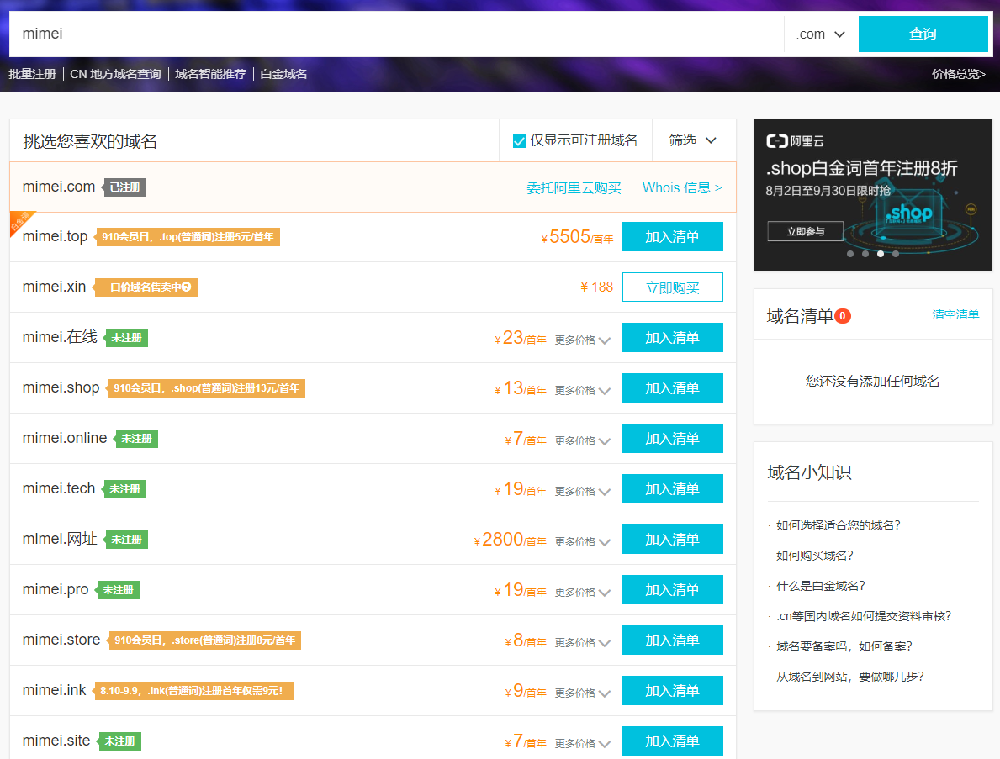

# 域名注册

要想实现一个web应用，域名可以说是必不可少的，人们通过域名来访问你的页面，应用之间通过域名来相互调用接口、资源等  
目前很有多平台都可以注册域名，我的这些服务基本都在[阿里云](https://www.aliyun.com/)完成的

## 域名注册
打开阿里云，你能看到它提供了纷繁复杂的服务内容，甚至连域名注册的入口都水容易发现，好在机智如我:)，在左上角的展开菜单里找到了入口：产品 > 精选 > 域名注册   
进入域名注册页面就可以在这里查找你心仪的域名了：

如果我想注册*mimei*这个关键词相关的域名，可以在搜索框里直接输入这个关键词进行搜索，其结果会告诉你这个关键词相关的域名是否可以注册：

如果显示“已注册”，说明这些域名已经被人注册了，你们就有办法再注册~ （可以尝试通过域名市场联系购买，这是另外的话题了）

现在假设我们将要注册的域名还是可注册状态，点击“加入清单”，这时会提交我们云登录，如果已经注册了帐户，直接登录就可以了。如果没有注册过阿里云，由于都是阿里系，你可以直接用taobao帐户或者支付宝帐户登录，这里不再赘诉，假设已经都完全了登录的过程，并且将想要的域名加入到了清单里，这时页面右侧的清单就会有我们所选的域名（当然你可以继续添加），点击“立即结算”，进入付款页面，按要求完成付款后，就算已经成功购买了。

## 域名解析
假设已经成功购买了域名，这里登录控制台后，通过左上角 -> 域名，进入域名管理页面，就可以看到我们刚刚购买的域名。  
通过域名对应的“解析”链接，进入该域名的解析页面，更详细的信息见阿里云域名解析[官方文档](https://help.aliyun.com/document_detail/29716.html)  
如果你对域名解析还没有明确概念，可以看一下知乎这个[帖子](https://www.zhihu.com/question/20266795)，应当会有帮助。

## 域名的备案

## https证书申请及部署