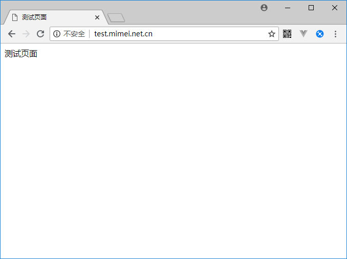
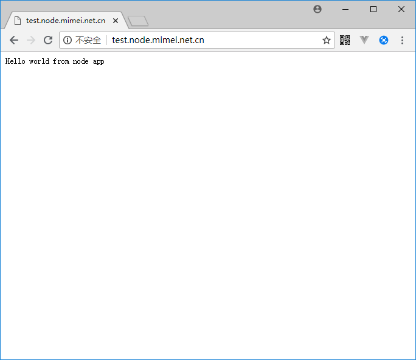

# nginx 配置
**Nginx** 是一个异步框架的 Web服务器，也可以用作反向代理，负载平衡器 和 HTTP 缓存。  
## Web服务器
由[域名](domain.md)一节了解到，当我们注册了一个域名，并将其解析到指定的服务器，服务器如何处理这个请求呢，这个时间就该nginx上场了。  
由于目前只有这一台主机，同时又想响应多个域名的请求，就需要用到vhost（虚拟主机），具体配置如下：
```
# vim /etc/nginx/nginx.conf
```
进入nginx的配置文件后，在倒数第2行插入
```
include /etc/nginx/vhost/*.conf;
```
保存退出编辑后，进入nginx目录并创建对应的文件夹和文件
```
# cd /etc/nginx/
# mkdir vhost
# cd vhost
```
例如已经将 test.mimei.net.cn 解析到服务器 39.106.197.173，现在创建对应的配置文件：mimei.net.cn-test.conf，如下
```
# vim mimei.net.cn-test.conf

server {
        listen  80;
        server_name  test.mimei.net.cn;
        root /var/www/mimei.net.cn/test/;

        access_log  /var/log/nginx/mimei.net.cn-test.log  main;

        location / {
            index  index.html index.htm;
        }

        error_page   500 502 503 504  /50x.html;
        location = /50x.html {
            root /var/www/mimei.net.cn/test/;
        }

        location ~ /.ht {
            deny  all;
        }
}

```
从配置文件可以知道，日志文件放在 /var/log/nginx/mimei.net.cn-test.log，网站根目录在：/var/www/mimei.net.cn/test/
，现在重新载入nginx配置文件，并在网站根目录创建一个文件：
```
# nginx -s reload
# vim /var/www/mimei.net.cn/test/index.html

<DOCTYPE html>
<html lang="en">
<head>
  <meta charset="UTF-8">
  <title>测试页面</title>
  <meta name="viewport" content="width=device-width, user-scalable=no, initial-scale=1.0, maximum-scale=1.0, minimum-scale=1.0">
</head>
测试页面
<body>
</body>
</html>

```
这里在浏览器里输入域名：http://test.mimei.net.cn/ ，可以看到：  
  
nginx配置虚拟主机就完成了。

## 反向代理
接下来以一个实例，看反向代理的应用：
```
# mkdir /var/www/mimei.net.cn/test.node
# cd /var/www/mimei.net.cn/test.node
# vim app.js

var http = require('http')
http.createServer(function(req, res){
        res.writeHead(200, {'Conent-type':'text/plain'})
        res.end('Hello world from node app \n')
}).listen(3000, '127.0.0.1')
console.log('running at:127.0.0.1:3000')

# node app.js 
running at:127.0.0.1:3000
```
这是一个极简的node应用已经运行起来了，可以通过如下方式来验证，新开一个连接：
```
# curl 127.0.0.1:3000
Hello world from node app 
```
可以看到，程序运行在3000端口，正确返回了内容。  
由于http默认的端口是80，3000如果做为对外应用的访问接口显然不合适，而且由于centos防火墙和阿里云的安全限制，外网根本访问不到3000端口，这里反向代理就排上用场了。  
下面来看具体的应用：
```
# vim /etc/nginx/vhost/mimei.net.cn-test.node.conf

server {
        listen 80;
        server_name test.node.mimei.net.cn;
        location / {
                proxy_pass http://127.0.0.1:3000;
        }
}
# nginx -s reload
```
这样就配置好了对应于域名 test.node.mimei.net.cn 的解析，将其访问代理到127.0.0.1:3000，通过浏览器访问，可以看到如下内容：  
  
至此nginx相关的内容结束