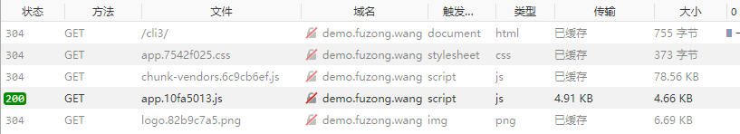

# HTTP 消息头 及 浏览器缓存 小结
作为开发人员大家都知道，从网络上获取资源成本比较高，客户端需要和服务端要进行多次通讯，如果能有效利用缓存，可以极大提高 web 应用的性能，所以有必要详细了解一个关于缓存的各个细节。

为防止出现理出现解上的偏差，在开始之前我们约定关于缓存处理指的是：当用户打个某个网址或者应用 `以后` 把它关闭，然后 `再次打开` 的的情况。

如果用户主动点击了 刷新 或者  强制刷新(CTRL+F5) 的情况在最后面再详细说。

## 概念篇

浏览器缓存分两个类型：`非验证性缓存` 和 `验证性缓存`

**非验证性缓存**：浏览器根据过期时间来判断是否使用缓存，如果在有效期内，直接从浏览器缓存中读取文件，**不发生http请求**，涉及到的 header 字段有 `Cache-Control`、`expires`、`pragma`

**验证性缓存**：给服务端发送请求时，在 header 里附带条件，服务端在处理请求时根据指定条件做出判断，如果符合条件则返回一个 304 状态码并返回空的 body ，浏览器在接收到 304 状态码后得知本地缓存依然有效，直接从本地缓存读取；如果条件为假则返回 200 状态码并返回指定资源。涉及到的 header 字段有 `etag` 、 `last-modified`

从以上内容可知，非验证性缓存最优，他从本地读取，甚至都不会发生网络请求；其次是验证性缓存，他会产生网络请求，但如果缓存可用，它返回的 body 为空，数据传输量也是非常小。

浏览器在判断缓存时的顺序是：

> 非验证性缓存 > 验证性缓存

下面开始逐个来讲，会涉及到一些服务器方面的知识，如果对 nginx 不熟，推荐看一下这篇文章：[前端工程师学习 Nginx 入门篇](https://juejin.im/entry/56f23b77a34131005438d2e5)

## 非验证性缓存

非验证性缓存 主要以 `Cache-Control`、`expires`、`pragma` 这三个消息头控制。由于 `pragma` 是 HTTP/1.0 中的规范，它在响应中的行为没有确切规范，而且他可以被 `Cache-Control` 覆盖，所以这里我们不说了，只看  `Cache-Control` 和 `expires` 。

### Cache-Control
如果在 nginx 的配置文件里有如下配置：
```bash
# nginx.conf
add_header Cache-Control max-age=20;
```
这个指令的含义是指定资源的过期时间是 20s ，在 20s 如果浏览器对这个资源有重复请求，将不会产生 http 请求，直接从浏览器缓存中读取，这个时候这个资源的请求响应头如下：
```bash
HTTP/1.1 200 OK
Server: nginx/1.12.2
Date: Fri, 28 Sep 2018 14:10:36 GMT
Content-Type: text/html
Content-Length: 755
Last-Modified: Thu, 27 Sep 2018 22:44:02 GMT
Connection: keep-alive
Cache-Control: max-age=20
Accept-Ranges: bytes
```
其他参数先不看，可以看到的是 `max-age=20` 定义了过期时间是 20s，同时可以在浏览器中验证。

Cache-control 用的最多的是 max-age ,但它还有其他很多指令，分别代表不同的含义：
```
Cache-control: must-revalidate
Cache-control: no-cache
Cache-control: no-store
Cache-control: no-transform
Cache-control: public
Cache-control: private
Cache-control: proxy-revalidate
Cache-Control: max-age=<seconds>
Cache-control: s-maxage=<seconds>
```
感兴趣的朋友可以在 MDN [Cache-control](https://developer.mozilla.org/zh-CN/docs/Web/HTTP/Headers/Cache-Control) 上详细了解。

### expires
现在重新配置 nginx 如下：
```bash
# nginx.conf
#add_header Cache-Control max-age=20;
add_header expires 'Thu, 27 Sep 2019 22:44:02 GMT';
```
注释掉 Cache-Control，添加一个 expires 值，是未来的某一时刻，这时再访问页面，响应头里会有如下信息：
```bash
HTTP/1.1 200 OK
Server: nginx/1.12.2
Date: Fri, 28 Sep 2018 14:45:15 GMT
Content-Type: text/html
Content-Length: 755
Last-Modified: Thu, 27 Sep 2018 22:44:02 GMT
Connection: keep-alive
expires: Thu, 27 Sep 2019 22:44:02 GMT
Accept-Ranges: bytes
```
从响应信息头中可以明确看出过期时间，在这个截至时间内访问都不会产生新的 http 请求，直接从浏览器缓存中读取资源。

### Cache-Control 优先级高于 expires
这个时候如果我们重新编辑 nginx 配置文件如下：
```bash
# nginx.conf
add_header Cache-Control max-age=20;
add_header expires 'Thu, 27 Sep 2019 22:44:02 GMT';
```

再访问如可以看到如下响应头信息：
```bash
HTTP/1.1 200 OK
Server: nginx/1.12.2
Date: Fri, 28 Sep 2018 14:49:50 GMT
Content-Type: text/html
Content-Length: 755
Last-Modified: Thu, 27 Sep 2018 22:44:02 GMT
Connection: keep-alive
Cache-Control: max-age=20
expires: Thu, 27 Sep 2019 22:44:02 GMT
Accept-Ranges: bytes
```
由于 Cache-Control 优先级高于 expires ，在实际测试过程中可知缓存在 20s 后就过期了。


## 验证性缓存
看完了非验证性缓存了解到他对静态资源非常重要，可以极大节省带宽，提升 web 应用性能。但有些资源有一定的时效性，需要经常去服务器验证是否有更新，如 html 、 api 接口等，这个时间就需要用到验证性缓存。

如前面所述，验证性更新需要向服务端发送一个请求，如果服务端判断没有更新，返回一个 304 状态码并返回一个空的 body 信息，浏览器可以直接从本地缓存读取资源。如果有更新，返回 200 状态码并将最新资源一并返回。

验证性缓存主要由 `last-modified` 和 `etag` 这两个消息头控制，接下来我们依次来看。

### last-modified
last-modified 是 nginx 默认开启的，所以不用手动去配置它。

由于 `非验证性缓存` 的优先级要高于  `验证性缓存`，所以测试的时候需要将他们设为无效，要不然看不到效果：
```bash
# nginx.conf
add_header Cache-Control max-age=0;
#add_header expires 'Thu, 27 Sep 2019 22:44:02 GMT'; # Cache-Control优先级较高，设置一个就好
```

现在再看，如果再次访问，请求头会带上类似如下字段：
```bash
...
If-Modified-Since: Thu, 27 Sep 2018 22:37:45 GMT
...
```

这个时候再测试，对于 **资源未更新** 的情况，响应头如下：
```bash
HTTP/1.1 304 Not Modified
Server: nginx/1.12.2
Date: Fri, 28 Sep 2018 15:29:06 GMT
Last-Modified: Thu, 27 Sep 2018 22:37:45 GMT # 明确标示最后修改时间
Connection: keep-alive
Cache-Control: max-age=0
```
也能看到浏览器端是直接从缓存中取的内容。

对于 **资源发生过更新** 的情况，响应头如下：
```bash
HTTP/1.1 200 OK
Server: nginx/1.12.2
Date: Fri, 28 Sep 2018 15:29:06 GMT
Content-Type: application/javascript
Content-Length: 4770
Last-Modified: Fri, 28 Sep 2018 15:29:03 GMT # 明确标示最后修改时间
Connection: keep-alive
Cache-Control: max-age=0
Accept-Ranges: bytes
```
见下图：



`last-modified` 和 `if-modified-since` 是成对出现的，分别的作用是：
- `last-modified` 在响应头里，服务器告诉浏览器，这个资源的最后修改时间是什么
- `if-modified-since` 在请求头里，告诉服务器我所请求的这个资源最后修改时间是什么。服务器根据这个值来判断，如果这个值和现有的值一致，直接返回 304 和空的 body，如果不服务端现有的值更新，则返回 200 和最新资源。

根据这两个时间，服务器和浏览器就能够决定资源是否是最新的，是否可以使用本地缓存。

### etag
`ETag` HTTP 响应头是资源的特定版本的标识符，它和 `last-modified` 类似，都是为了实现资源的验证性缓存，但 `etag` 精度更高（ `last-modified` 只能精确到秒），同时 `etag` 还能避免“空中碰撞”，详细的解释可以看 MDN 的 [Etag](https://developer.mozilla.org/zh-CN/docs/Web/HTTP/Headers/ETag) 介绍。

下面直接来看他的实现：
```bash
etag on;
add_header Cache-Control max-age=0;
#add_header expires 'Thu, 27 Sep 2019 22:44:02 GMT'; 
add_header Last-Modified ''; # 为了测试 etag 的效果，将 last-modified 设为无效
```

现在再看，如果再次访问，请求头会带上如下字段：
```bash
...
If-None-Match: "5bad5bb9-13a3f"
...
```
这个时候再测试，对于 **资源未更新** 的情况，响应头如下：
```bash
HTTP/1.1 304 Not Modified
Server: nginx/1.12.2
Date: Fri, 28 Sep 2018 22:43:11 GMT
Connection: keep-alive
ETag: "5bad5bb9-13a3f"
Cache-Control: max-age=0
```
可以看到浏览器端是直接从缓存中取的内容。

对于 **资源发生过更新** 的情况，响应头如下：
```bash
HTTP/1.1 200 OK
Server: nginx/1.12.2
Date: Fri, 28 Sep 2018 22:43:11 GMT
Content-Type: application/javascript
Content-Length: 4770
Connection: keep-alive
ETag: "5baeae7a-12a2"
Cache-Control: max-age=0
Accept-Ranges: bytes
```
可以看到服务器将最新的内容传输给浏览器，并返回 200 code

`etag` 和 `if-none-match` 是成对出现的，
- etag 是服务器根据一定规则生成的资源‘指纹’，传递给客户端，客户端将其与缓存一起保存
- if-none-match 是客户端在发送请求时将本地的 etag 值通过头信息传递给服务端，服务端与其当前版本的资源的ETag进行比较，如果两个值匹配（即资源未更改），服务器将返回不带任何内容的304未修改状态，告诉客户端缓存版本可用。如果 etag 值匹配不成功，返回 200 code 和资源内容。

## 用户主动刷新行为
当用户主动点击了 刷新 或者 强刷刷新，浏览器会在请求头信息里附上不同的字段，来告诉服务器如何处理这个行为。
### 用户点击 刷新
当用户点击刷新时，浏览器在请求头里会加上如下字段：
```bash
If-Modified-Since: Fri, 28 Sep 2018 22:43:06 GMT # 如果开启了 If-Modified
If-None-Match: "5baeae7a-12a2" # 如果开启了 etag
Cache-Control: max-age=0
```
这时即便 `Cache-Control` 设置了更大的值，也不会从缓存中直接读取，而是要发送一条新的请求去服务器验证资源是否有更新

### 用户点击 强制刷新
当用户点击强制刷新时，浏览器在请求头里会加上如下字段：
```bash
Pragma: no-cache
Cache-Control: no-cache
```
可以看到，即便 `Cache-Control` 设置了更大的值，也不会从缓存中直接读取，而且不会发送 `If-Modified-Since` 和 `If-None-Match` ，也就是说服务器得不到资源的最后更新时间和 etag 值，无论如何都会返回最新的资源。

这也是为什么需求方找我们看问题的时候，我们总是喜欢让他们强制刷新的原因...


> **Note:** Cache-Control 标头是在 HTTP/1.1 规范中定义的，取代了之前用来定义响应缓存策略的标头（例如 Expires）。所有现代浏览器都支持 Cache-Control，因此，使用它就够了。


## 参考文档
- [https://developer.mozilla.org/zh-CN/docs/Web/HTTP/Headers](https://developer.mozilla.org/zh-CN/docs/Web/HTTP/Headers)
- [https://developer.mozilla.org/zh-CN/docs/Web/HTTP/Headers/Etag](https://developer.mozilla.org/zh-CN/docs/Web/HTTP/Headers/Etag)
- [https://developer.mozilla.org/zh-CN/docs/Web/HTTP/Headers/Last-Modified](https://developer.mozilla.org/zh-CN/docs/Web/HTTP/Headers/Last-Modified)
- [https://developer.mozilla.org/zh-CN/docs/Web/HTTP/Headers/Cache-Control](https://developer.mozilla.org/zh-CN/docs/Web/HTTP/Headers/Cache-Control)
- [https://blog.csdn.net/eroswang/article/details/8302191](https://blog.csdn.net/eroswang/article/details/8302191)
- [https://www.v2ex.com/t/356353](https://www.v2ex.com/t/356353)
- [https://developers.google.com/web/fundamentals/performance/optimizing-content-efficiency/http-caching](https://developers.google.com/web/fundamentals/performance/optimizing-content-efficiency/http-caching)
- [http://imweb.io/topic/5795dcb6fb312541492eda8c](http://imweb.io/topic/5795dcb6fb312541492eda8c)